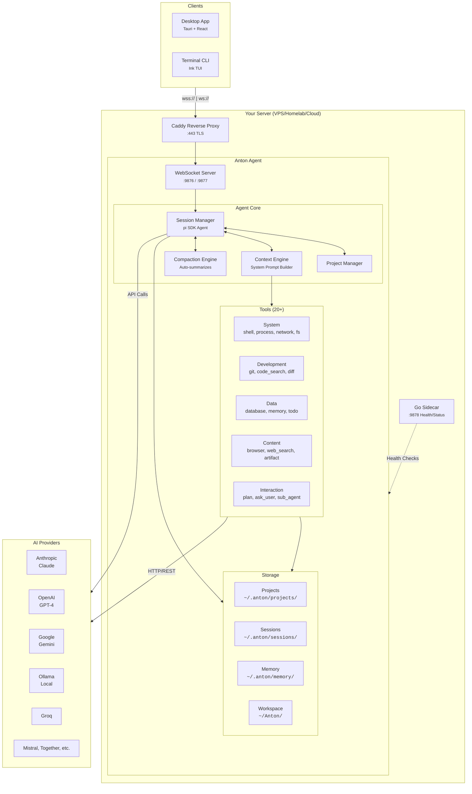
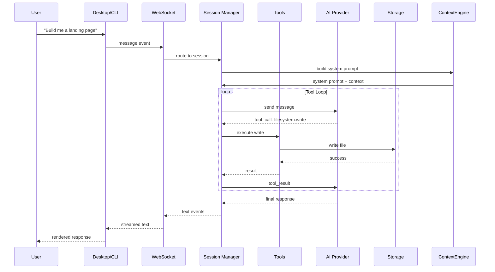
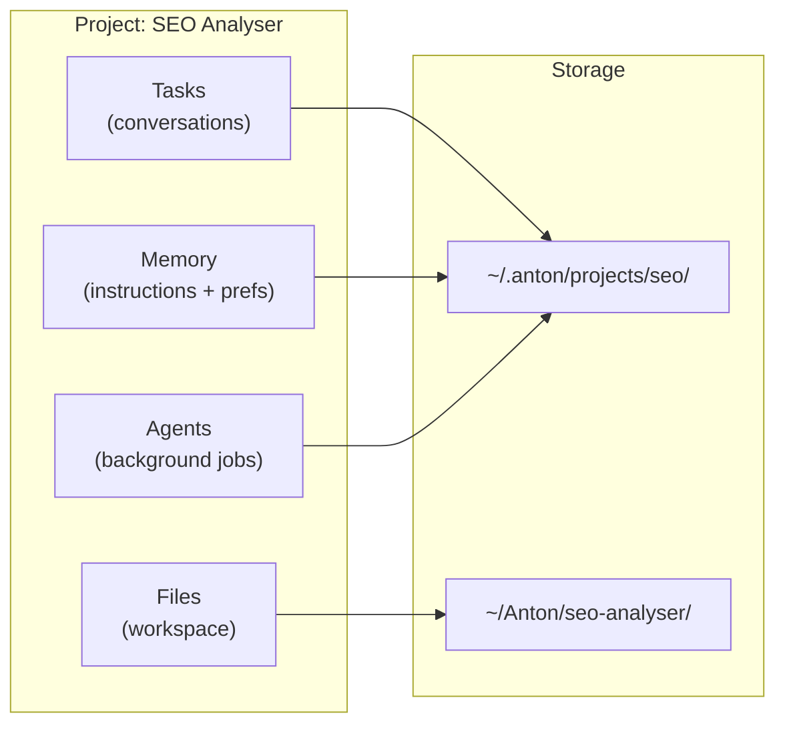

<div align="center">

# anton.computer

### A computer that thinks.

Give Anton a task. It figures out the rest — writes the code, deploys it,<br>monitors it, and tells you when it's done. Always on. Never stops. **Yours.**

[](LICENSE)
[](https://github.com/OmGuptaIND/computer/releases)
[](https://github.com/OmGuptaIND/computer/issues)

**[Website](https://antoncomputer.in)** &middot; **[Docs](https://docs.antoncomputer.in)** &middot; **[Releases](https://github.com/OmGuptaIND/computer/releases)**

</div>

---

## What is Anton?

Anton is an AI agent that lives on its own computer. Not a chatbot. Not a copilot. A machine that runs 24/7, remembers everything, and does the actual work.

Other AI tools give you text. Anton gives you results:

```
"Monitor my competitor's pricing every 6 hours and alert me when prices change"
-> Anton set up automated monitoring, takes screenshots, diffs them, emails you summaries.

"Build me a landing page and deploy it"
-> Anton designed, coded, and deployed. Live URL in 20 minutes.

"Scrape every YC company from the last 3 batches and find ones in my space"
-> Anton scraped, categorized 800+ companies, exported a filtered spreadsheet.
```

**No templates. No plugins. Just tell it what you need.**

---

## Quick Start

### Option 1: Try the Hosted Version

The fastest way to try Anton. We handle the server, you just use it.

**[antoncomputer.in](https://antoncomputer.in)** — Free tier available

### Option 2: Run It Yourself

Want full control? Deploy Anton on your own server.

**One-line install:**
```bash
curl -fsSL https://antoncomputer.in/install | bash
```

The install script handles everything: downloads the agent, sets up systemd, configures your API key, and starts the service.

**Prerequisites:**
- A VPS or server (Ubuntu 20.04+, Debian 11+)
- An AI provider API key ([Anthropic](https://anthropic.com), [OpenAI](https://openai.com), [Groq](https://groq.com), etc.)

**Connect to your agent:**
```bash
# Desktop app
Open the app -> Enter your server IP and token

# Or use the CLI
curl -fsSL https://antoncomputer.in/install | bash -- --cli
anton connect 203.0.113.10 --token ak_your_token_here
```

### Option 3: Develop Anton

**Prerequisites:** Node.js 22+, pnpm 9+
**Optional:** Go 1.25+ (sidecar), Rust + Tauri CLI (desktop app)

```bash
git clone https://github.com/OmGuptaIND/computer.git
cd computer
pnpm install
pnpm dev              # agent + desktop
pnpm agent:dev        # agent only
pnpm cli:dev          # CLI only
```

> `~/.anton/config.yaml` is auto-generated on first run.

---

## CLI Reference

### Connect & Use

| Command | Description |
|---------|-------------|
| `anton` | Interactive REPL |
| `anton connect [host]` | Connect to an agent (`--token`, `--name`, `--tls`) |
| `anton chat "message"` | One-shot message |
| `anton shell` | Remote shell |

### Server Management

| Command | Description |
|---------|-------------|
| `anton computer setup` | Set up agent on this machine (`--token`, `--port`, `--yes`) |
| `anton computer status` | Agent + sidecar health check |
| `anton computer logs [target]` | View logs — target: `agent`, `sidecar`, `deploy` (`-f`, `-n`) |
| `anton computer start` | Start services |
| `anton computer stop` | Stop services |
| `anton computer restart` | Restart services |
| `anton computer update` | Update agent binary |
| `anton computer doctor` | Diagnose & fix machine setup (`--fix`) |
| `anton computer config` | Manage config |
| `anton computer version` | Show agent version |
| `anton computer sidecar` | Manage sidecar |
| `anton computer uninstall` | Remove agent (`--purge` to also delete user + data) |
| `anton status [host] [port]` | Remote agent health check |

### Saved Machines

| Command | Description |
|---------|-------------|
| `anton machines` | List saved machines |
| `anton machines rm <name>` | Remove a machine |
| `anton machines default <name>` | Set default machine |

### Connectors

| Command | Description |
|---------|-------------|
| `anton connector` | List configured + available connectors |
| `anton connector connect <id>` | Connect a built-in OAuth connector |
| `anton connector disconnect <id>` | Disconnect/remove a connector |

### Other

| Command | Description |
|---------|-------------|
| `anton skills [list\|run <name>]` | Manage background skills |
| `anton update` | Update CLI |
| `anton help` | Show help |

---

## Features

| Category | Examples |
|----------|----------|
| **Build & Deploy** | Create projects, write tests, deploy to any cloud |
| **Monitor & Alert** | Watch services, log errors, restart on crash |
| **Research & Scrape** | Collect data, categorize companies, generate reports |
| **Automate** | Run cron jobs, sync files, manage infrastructure |
| **Create** | Build websites, write docs, generate content |

Anton doesn't generate code for you to copy-paste. It runs the commands, creates the files, and deploys the result.

- **Always on** — Works while you sleep. Schedules tasks, runs cron jobs, monitors systems.
- **20+ built-in tools** — Shell, filesystem, git, browser, database, web search, and more.
- **Persistent memory** — Remembers projects, context, and preferences across sessions.
- **Your choice of AI** — Claude, GPT-4, Gemini, Ollama (local), Groq, Together, Mistral, and more.
- **Two interfaces** — Native desktop app (Tauri) or terminal CLI.
- **Extensible** — Add custom tools and connectors in TypeScript.
- **Self-hosted** — Your server, your data. Zero vendor lock-in.

---

## Architecture



### Data Flow



### Project-First Architecture

Every task, file, agent, and memory is scoped to a **Project**:



---

## Protocol

Single WebSocket connection, multiplexed across 5 channels:

| Channel | ID | Purpose |
|---------|-----|---------|
| `CONTROL` | 0x00 | Auth, ping/pong, config, updates |
| `TERMINAL` | 0x01 | Remote PTY (terminal) access |
| `AI` | 0x02 | Sessions, chat, tool calls, confirmations |
| `FILESYNC` | 0x03 | Remote filesystem browsing |
| `EVENTS` | 0x04 | Status updates, notifications |

---

## Development

### pnpm Scripts

| Command | Description |
|---------|-------------|
| `pnpm dev` | Agent + desktop concurrently |
| `pnpm dev:local` | Same, with `ANTON_LOCAL=1` |
| `pnpm agent:dev` | Agent server only (port 9876) |
| `pnpm cli:dev` | CLI in watch mode |
| `pnpm desktop:dev` | Desktop Vite dev server |
| `pnpm desktop:app` | Full Tauri desktop app |
| `pnpm build` | Build all packages |
| `pnpm verify` | Typecheck + lint |
| `pnpm clean` | Remove all `dist/` |

### Makefile Reference

Run `make help` for all targets. Key targets below:

<details>
<summary>Deployment targets</summary>

| Target | Description |
|--------|-------------|
| `make deploy` | Full deploy to all hosts via Ansible |
| `make sync` | Build locally + rsync to VPS + restart (fast dev deploy) |
| `make update` | Pull latest + rebuild on all hosts |
| `make verify` | Health check across all hosts |
| `make status` | Check if agent service is running |
| `make logs` | Tail last 50 lines of agent logs |
| `make restart` | Restart agent on all hosts |
| `make stop` | Stop agent on all hosts |
| `make ping` | Test SSH connectivity |
| `make check` | Dry-run the Ansible playbook |
| `make env` | Show agent.env contents (redacts secrets) |
| `make setup` | Install Ansible on this machine |

</details>

<details>
<summary>Release targets</summary>

| Target | Description |
|--------|-------------|
| `make release` | Bump version, changelog, tag, push, trigger CI |
| `make preflight` | Verify all CI build steps pass locally |

</details>

<details>
<summary>Eval targets</summary>

| Target | Description |
|--------|-------------|
| `make eval` | Run all 9 eval suites (87 cases) |
| `make eval-dry` | Validate datasets without LLM calls |
| `make eval-tools` | Tool selection evals (35 cases) |
| `make eval-safety` | Safety/refusal evals (16 cases) |
| `make eval-quality` | Response quality evals (10 cases) |
| `make eval-code` | Code generation evals (10 cases) |
| `make eval-planning` | Task planning evals (8 cases) |
| `make eval-context` | Context awareness evals (8 cases) |
| `make eval-chat` | All chat evals (26 cases) |
| `make eval-workflows` | All workflow evals (24 cases) |

</details>

### Package Structure

```
computer/
├── packages/
│   ├── protocol/           # Shared types, codec, message definitions
│   ├── agent-config/      # Project/session persistence, config loading
│   ├── agent-core/        # Session runtime, tools, context injection
│   ├── agent-server/      # WebSocket server, message routing, PTY
│   ├── desktop/           # Tauri v2 desktop app (React 19 + Zustand)
│   ├── cli/               # Terminal client (Ink TUI)
│   ├── connectors/        # External integrations
│   └── logger/            # Logging utilities
├── sidecar/               # Go sidecar for health checks & diagnostics
├── desktop/               # Desktop app assets
├── deploy/
│   ├── ansible/           # Production deployment (recommended)
│   ├── Dockerfile         # Docker image
│   └── install.sh         # One-command VPS setup
└── specs/
    └── architecture/      # Full protocol & architecture specs
```

---

## Configuration

Agent config at `~/.anton/config.yaml` (auto-generated on first run):

```yaml
agentId: anton-myserver
token: ak_...           # Generated on install
port: 9876

providers:
  anthropic:
    apiKey: ""
    models: [claude-sonnet-4-6, claude-opus-4-6]
  openai:
    apiKey: ""
    models: [gpt-4o, gpt-4o-mini]
  # Also supported: google, ollama, groq, together, mistral, openrouter

defaults:
  provider: anthropic
  model: claude-sonnet-4-6

security:
  confirmPatterns: [rm -rf, sudo, shutdown]
  forbiddenPaths: [/etc/shadow, ~/.ssh/id_*]
```

---

## Deploying to a Remote Machine

Anton is designed to run on a remote server — a VPS, homelab, or cloud instance that stays on 24/7. The deployment pipeline clones the full repo to `/opt/anton`, builds it, sets up systemd, and optionally configures Caddy as a reverse proxy with automatic TLS.

### Step 1: Configure Your Inventory

Edit `deploy/ansible/inventory.ini` with your server(s):

```ini
[anton_agents]
agent1  ansible_host=203.0.113.10 ansible_user=ubuntu ansible_ssh_private_key_file=~/.ssh/key anton_domain=agent1.yourdomain.com

[anton_agents:vars]
anthropic_api_key=sk-ant-...
```

| Variable | Default | Purpose |
|----------|---------|---------|
| `anton_domain` | `""` | Domain for Caddy + auto-TLS (required for HTTPS) |
| `anton_port` | `9876` | Agent WebSocket port |
| `anthropic_api_key` | `""` | AI provider key (written to env file) |
| `anton_branch` | `main` | Git branch to deploy |
| `anton_configure_firewall` | `true` | Open ports 80/443 via UFW |

### Step 2: Deploy

```bash
make setup                              # Install Ansible (one-time)
make deploy                             # Deploy to all hosts
make deploy HOST=agent1 API_KEY=sk-...  # Deploy to one host with API key
```

The playbook handles everything: installs Node.js 22 + pnpm, creates an `anton` user, clones the repo, builds all packages, writes the systemd service, and starts the agent.

### Step 3: Add a Domain (Caddy + TLS)

When you set `anton_domain` in your inventory, the playbook automatically:

1. Installs Caddy
2. Deploys a Caddyfile that reverse-proxies HTTPS to the agent
3. Provisions a Let's Encrypt certificate (zero config)
4. Opens ports 80/443 in the firewall

**Caddy routes:**

| Route | Destination |
|-------|-------------|
| `https://your-domain.com/*` | Agent WebSocket (port 9876) |
| `https://your-domain.com/a/*` | Published artifacts (`~/.anton/published/`) |
| `https://your-domain.com/p/*` | Project public files (`~/Anton/`) |
| `https://your-domain.com/_anton/health` | Sidecar health check (port 9878) |

> Point your DNS A record to the server IP **before** deploying. Caddy needs DNS to resolve to obtain the TLS certificate.

### Step 4: Connect

```bash
# Desktop app
Open the app -> Enter https://agent1.yourdomain.com + token

# CLI
anton connect agent1.yourdomain.com --token ak_... --tls
```

### Fast Dev Deploy: `make sync`

For rapid iteration without pushing to git — builds locally, rsyncs to the VPS, and restarts the service:

```bash
make sync                 # All hosts
make sync HOST=agent1     # One host
```

### Managing Remote Agents

```bash
make verify               # Health dashboard (status, ports, version, uptime)
make status               # Service status on all hosts
make logs                 # Tail last 50 log lines
make restart              # Restart the agent
make update               # Pull latest + rebuild (no system setup)
make env                  # Show env vars (redacts secrets)
```

### Alternative Deployment Methods

<details>
<summary>Docker</summary>

```bash
git clone https://github.com/OmGuptaIND/computer.git
cd computer
export ANTHROPIC_API_KEY=sk-ant-...
docker compose -f deploy/docker-compose.yml up -d
```

</details>

<details>
<summary>Manual install script</summary>

```bash
git clone https://github.com/OmGuptaIND/computer.git ~/.anton/agent
cd ~/.anton/agent && bash deploy/install.sh
```

</details>

### VPS Directory Layout

```
/opt/anton/                    # Full repo clone (built)
/home/anton/.anton/
  agent.env                    # API keys + token (mode 0600)
  config.yaml                  # Agent config (auto-generated)
  version.json                 # Deploy metadata (version, git hash, timestamp)
  sessions/                    # AI session state
  projects/                    # Project data
  published/                   # Caddy-served artifacts (/a/*)
/home/anton/Anton/             # Caddy-served project files (/p/*)
/etc/caddy/Caddyfile           # Reverse proxy + TLS config
```

---

## Why "Anton"?

In *Silicon Valley*, Gilfoyle builds a sentient computer and names it **Anton**. Not a chatbot. Not an assistant. A machine that thinks, acts, and runs on its own hardware.

What made Anton special wasn't just intelligence — it was that Anton had **its own space to exist**. Its own processes, its own environment. It could self-improve, run experiments, and keep working after everyone went home.

Then OpenClaw proved the concept: give AI a computer to use and it browses, clicks, writes code, deploys. The breakthrough isn't smarter text. It's **giving AI a machine to work on.**

Gilfoyle was right. We just made it real.

---

## Contributing

We welcome contributions! Open source because AI agents should be owned by the people who use them.

1. Fork & clone the repo
2. `pnpm install`
3. Create a branch: `git checkout -b feat/your-feature`
4. Make changes, run `pnpm verify` (typecheck + lint)
5. Open a Pull Request

**Areas to contribute:**
- New tools and capabilities
- Desktop UI improvements
- CLI enhancements
- Deployment options (Kubernetes, new clouds)
- Documentation and tutorials

---

## Links

- **Website:** [antoncomputer.in](https://antoncomputer.in)
- **Documentation:** [docs.antoncomputer.in](https://docs.antoncomputer.in)
- **Issues:** [github.com/OmGuptaIND/computer/issues](https://github.com/OmGuptaIND/computer/issues)
- **Releases:** [github.com/OmGuptaIND/computer/releases](https://github.com/OmGuptaIND/computer/releases)

---

## License

[Apache License 2.0](LICENSE) — Use it, modify it, build on it.
