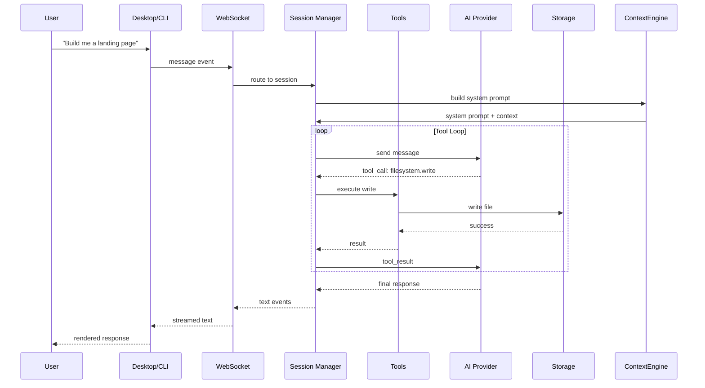
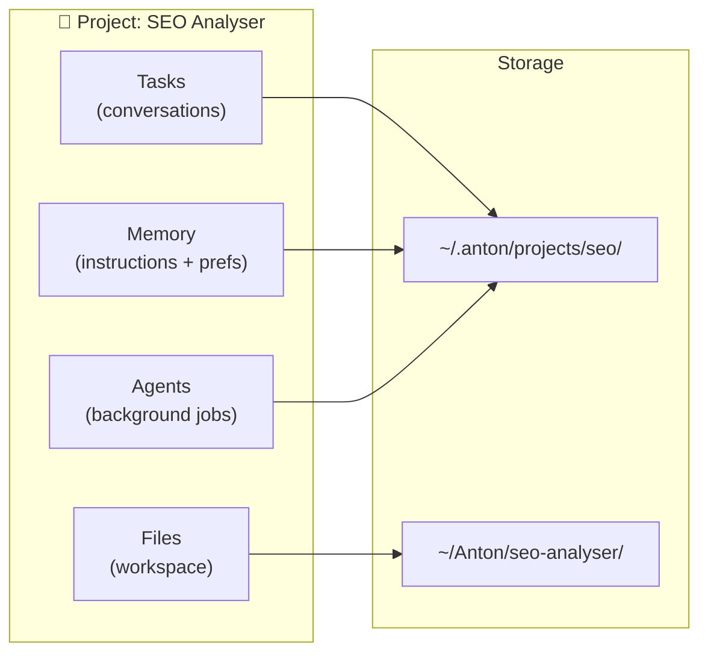

# antoncomputer.in

> **A computer that thinks.**

Give Anton a task. It figures out the rest — writes the code, deploys it, monitors it, and tells you when it's done. Always on. Never stops. Yours.

[](LICENSE)
[](https://github.com/OmGuptaIND/computer/releases)
[](https://github.com/OmGuptaIND/computer/issues)

---

## What is Anton?

Anton is an AI agent that lives on its own computer. Not a chatbot. Not a copilot. A machine that runs 24/7, remembers everything, and does the actual work.

Other AI tools give you text. Anton gives you results:

```
"Monitor my competitor's pricing every 6 hours and alert me when prices change"
→ Anton set up automated monitoring, takes screenshots, diffs them, emails you summaries.

"Build me a landing page and deploy it"
→ Anton designed, coded, and deployed. Live URL in 20 minutes.

"Scrape every YC company from the last 3 batches and find ones in my space"
→ Anton scraped, categorized 800+ companies, exported a filtered spreadsheet.
```

**No templates. No plugins. Just tell it what you need.**

---

## Why "Anton"?

In *Silicon Valley*, Gilfoyle builds a sentient computer and names it **Anton**. Not a chatbot. Not an assistant. A machine that thinks, acts, and runs on its own hardware.

What made Anton special wasn't just intelligence — it was that Anton had **its own space to exist**. Its own processes, its own environment. It could self-improve, run experiments, and keep working after everyone went home.

Then OpenClaw proved the concept: give AI a computer to use and it browses, clicks, writes code, deploys. The breakthrough isn't smarter text. It's **giving AI a machine to work on.**

Gilfoyle was right. We just made it real.

---

## Architecture


### Data Flow



### Project-First Architecture

Every task, file, agent, and memory is scoped to a **Project**:



---

## Get Started

### Option 1: Try the Hosted Version

The fastest way to try Anton. We handle the server, you just use it.

👉 **[antoncomputer.in](https://antoncomputer.in)** — Free tier available

### Option 2: Run It Yourself

Want full control? Deploy Anton on your own server.

**One-line install:**
```bash
curl -fsSL https://antoncomputer.in/install | bash
```

The install script handles everything: downloads the agent, sets up systemd, configures your API key, and starts the service.

**Prerequisites:**
- A VPS or server (Ubuntu 20.04+, Debian 11+)
- An AI provider API key ([Anthropic](https://anthropic.com), [OpenAI](https://openai.com), [Groq](https://groq.com), etc.)

**Connect to your agent:**
```bash
# Desktop app
Open the app → Enter your server IP and token

# Or use the CLI
curl -fsSL https://antoncomputer.in/install | bash -- --cli
anton connect 203.0.113.10 --token ak_your_token_here
```

---

## What Can It Do?

| Category | Examples |
|----------|----------|
| **Build & Deploy** | Create projects, write tests, deploy to any cloud |
| **Monitor & Alert** | Watch services, log errors, restart on crash |
| **Research & Scrape** | Collect data, categorize companies, generate reports |
| **Automate** | Run cron jobs, sync files, manage infrastructure |
| **Create** | Build websites, write docs, generate content |

Anton doesn't generate code for you to copy-paste. It runs the commands, creates the files, and deploys the result.

---

## Features

- **Always on** — Works while you sleep. Schedules tasks, runs cron jobs, monitors systems.
- **20+ built-in tools** — Shell, filesystem, git, browser, database, web search, and more.
- **Persistent memory** — Remembers projects, context, and preferences across sessions.
- **Your choice of AI** — Claude, GPT-4, Gemini, Ollama (local), Groq, Together, Mistral, and more.
- **Two interfaces** — Native desktop app (Tauri) or terminal CLI.
- **Extensible** — Add custom tools and connectors in TypeScript.
- **Self-hosted** — Your server, your data. Zero vendor lock-in.

---

## Package Structure

```
computer/
├── packages/
│   ├── protocol/           # Shared types, codec, message definitions
│   ├── agent-config/      # Project/session persistence, config loading
│   ├── agent-core/        # Session runtime, tools, context injection
│   ├── agent-server/      # WebSocket server, message routing, PTY
│   ├── desktop/           # Tauri v2 desktop app (React 19 + Zustand)
│   ├── cli/               # Terminal client (Ink TUI)
│   ├── connectors/        # External integrations
│   └── logger/            # Logging utilities
├── sidecar/               # Go sidecar for health checks & diagnostics
├── desktop/               # Desktop app assets
├── deploy/
│   ├── ansible/           # Production deployment (recommended)
│   ├── Dockerfile         # Docker image
│   └── install.sh         # One-command VPS setup
└── specs/
    └── architecture/      # Full protocol & architecture specs
```

---

## Protocol

Single WebSocket connection, multiplexed across 5 channels:

| Channel | ID | Purpose |
|---------|-----|---------|
| `CONTROL` | 0x00 | Auth, ping/pong, config, updates |
| `TERMINAL` | 0x01 | Remote PTY (terminal) access |
| `AI` | 0x02 | Sessions, chat, tool calls, confirmations |
| `FILESYNC` | 0x03 | Remote filesystem browsing |
| `EVENTS` | 0x04 | Status updates, notifications |

---

## Deployment Options

### Ansible (Recommended)
```bash
make setup
# Add your VPS to deploy/ansible/inventory.ini
make deploy HOST=myserver API_KEY=sk-ant-...
```

### Docker
```bash
git clone https://github.com/OmGuptaIND/computer.git
cd computer
export ANTHROPIC_API_KEY=sk-ant-...
docker compose -f deploy/docker-compose.yml up -d
```

### Manual
```bash
git clone https://github.com/OmGuptaIND/computer.git ~/.anton/agent
cd ~/.anton/agent && bash deploy/install.sh
```

---

## Configuration

Agent config at `~/.anton/config.yaml`:

```yaml
agentId: anton-myserver
token: ak_...           # Generated on install
port: 9876

providers:
  anthropic:
    apiKey: ""
    models: [claude-sonnet-4-6, claude-opus-4-6]
  openai:
    apiKey: ""
    models: [gpt-4o, gpt-4o-mini]
  # Also supported: google, ollama, groq, together, mistral, openrouter

defaults:
  provider: anthropic
  model: claude-sonnet-4-6

security:
  confirmPatterns: [rm -rf, sudo, shutdown]
  forbiddenPaths: [/etc/shadow, ~/.ssh/id_*]
```

---

## Quick Commands

```bash
pnpm dev           # Run locally (agent + desktop)
make status        # Check service health
make logs          # View agent logs
make restart       # Restart the service
make release       # Cut a new release
```

---

## Contributing

We welcome contributions! Open source because AI agents should be owned by the people who use them.

1. Fork & clone the repo
2. `pnpm install`
3. Create a branch: `git checkout -b feat/your-feature`
4. Make changes, run `pnpm verify` (typecheck + lint)
5. Open a Pull Request

**Areas to contribute:**
- New tools and capabilities
- Desktop UI improvements
- CLI enhancements
- Deployment options (Kubernetes, new clouds)
- Documentation and tutorials

---

## Links

- 🌐 **Website:** [antoncomputer.in](https://antoncomputer.in)
- 📖 **Documentation:** [docs.antoncomputer.in](https://docs.antoncomputer.in)
- 🐛 **Issues:** [github.com/OmGuptaIND/computer/issues](https://github.com/OmGuptaIND/computer/issues)
- 📦 **Releases:** [github.com/OmGuptaIND/computer/releases](https://github.com/OmGuptaIND/computer/releases)

---

## License

[Apache License 2.0](LICENSE) — Use it, modify it, build on it.
